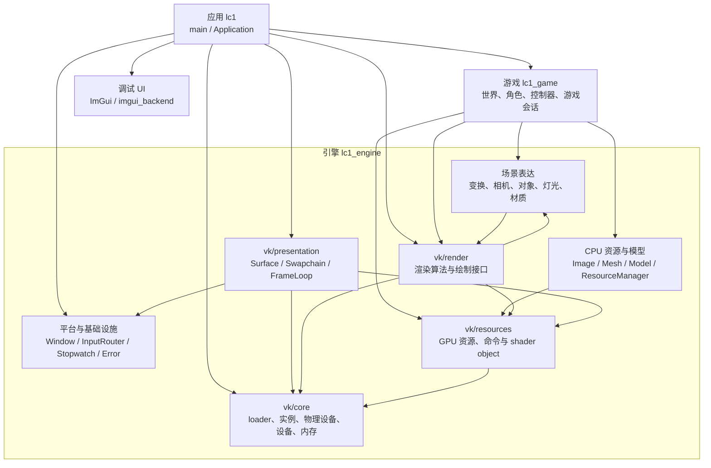
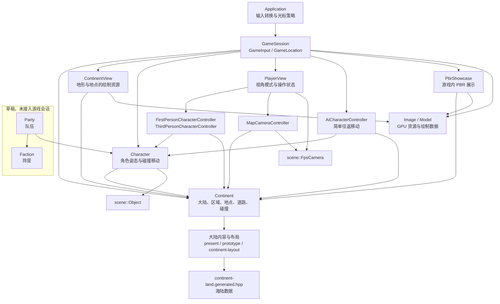
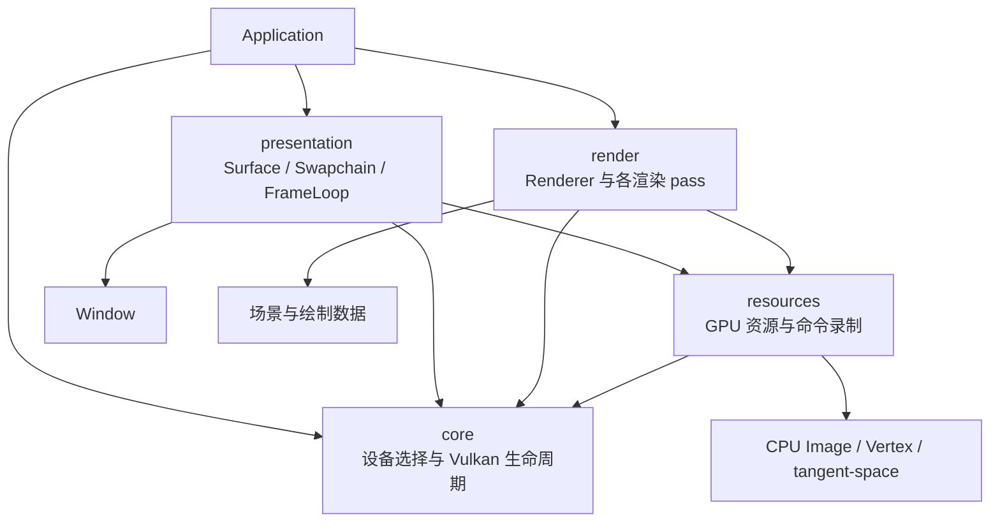
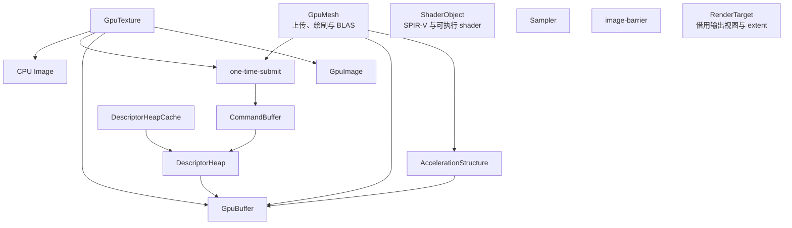
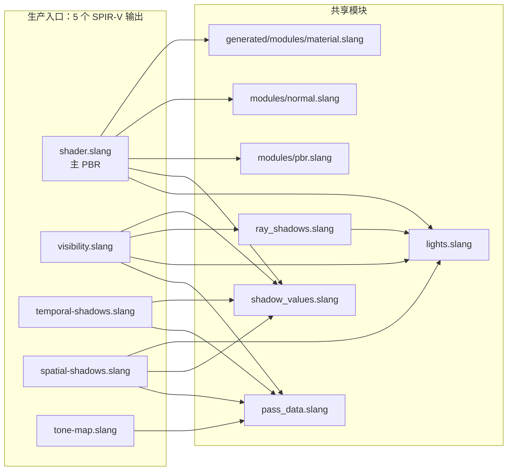
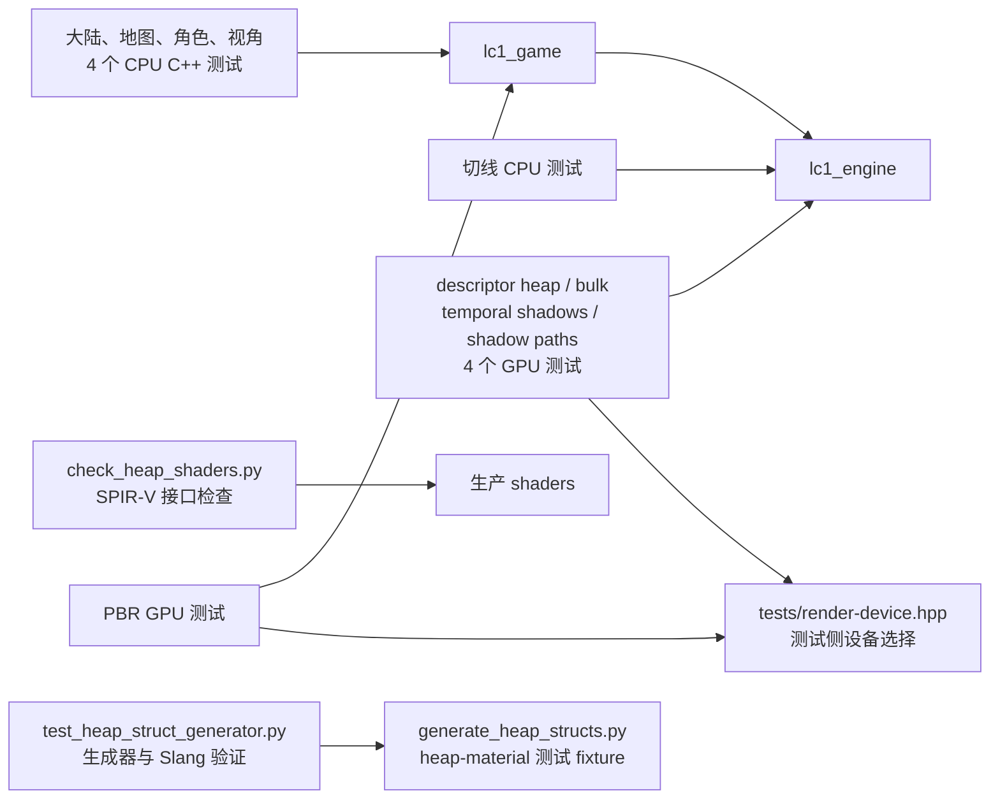
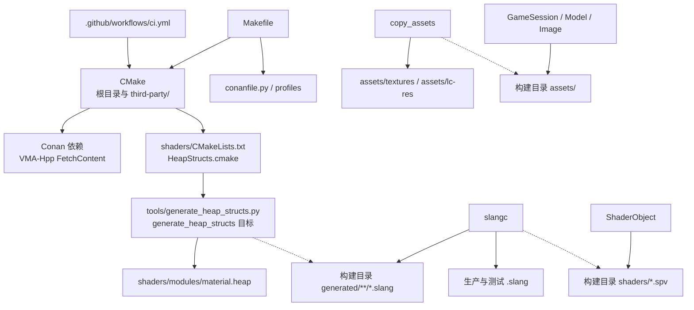
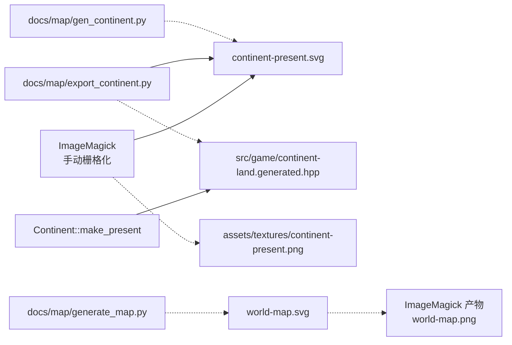

# 模块依赖图

这类图通常称为**模块依赖图（Module Dependency Diagram）**，也可称为组件架构图。
本文使用 Mermaid flowchart 表达当前代码的模块划分与依赖，不采用严格的 UML 组件图语法。

## 阅读约定

- 范围是当前工作树中的第一方模块，包括应用、游戏、引擎、shader、测试和离线工具；
  第三方库只列直接依赖，不展开库内部实现。
- `A --> B` 表示 **A 使用或依赖 B**，不是调用时序、所有权或数据流。
  工具链图的虚线箭头 `-.->` 单独表示“生成／复制”。
- 分图按职责展开同一个系统；同一节点重复出现不表示存在多个实例。
  小型同职责文件合并为节点，表格给出完整模块索引，不逐一绘制每个函数、资产或传递依赖。
- 标有“草稿／未接入”的代码确实存在，但不是当前运行链路。规划中的成长、战斗、经济、
  装备和完整寻路系统不算已实现模块。
- 图中不使用颜色编码；模块边界、关系与状态均以文字表达，配色交给 Markdown 渲染器。

## 1. 全局总览



真正的链接目标是 `lc1 → lc1_game → lc1_engine`，另有 `lc1 → imgui_backend`。
Vulkan 四层仍在同一个 `lc1_engine` 库内，并非四个独立库。`lc1` 还构建依赖 `shaders`
与 `copy_assets`，生成和测试关系见后文。

`scene` 与 `render` 的双向箭头是当前接口粒度下的真实依赖：`scene::Object` 使用
`DrawItem`，而渲染器使用场景相机、灯光等数据；不是场景对象反过来调度 Renderer。
第 3 节将数据接口拆开，展示更细的边界。

## 2. 游戏模块



| 模块 | 位置与职责 |
|---|---|
| 游戏会话 | `game/game-session.*`：组织世界、玩家、资源、灯光和绘制列表 |
| 世界规则与内容 | `game/continent.hpp`、`src/game/continent.cpp`；`continent-present.cpp`、`continent-prototype.cpp`、私有 `continent-layout.*` 和生成的海陆数据 |
| 世界可绘制表示 | `game/continent-view.*`：把世界数据变成网格、纹理和绘制项 |
| 角色 | `game/character.*`：`scene::Object` 保存唯一世界姿态，移动使用大陆碰撞 |
| 玩家控制 | `game/player-controller.*`、`game/player-view.*`、`game/map-camera-controller.*`：移动、第一／第三人称切换、地图相机 |
| 简单 AI | `game/ai-character-controller.hpp`：会话已使用的往返控制，不是完整寻路 |
| 调试展示 | `game/debug/pbr-showcase.*`：同时被游戏和 PBR GPU 测试使用 |
| 队伍、阵营 | `game/party.hpp`、`game/faction.hpp`：草稿，未接入 |

表中的 `game/` 文件对位于 `include/lc1/game/` 和 `src/game/`，具体扩展名为 `.hpp`／`.cpp`。
`GameSession`、`PlayerView` 和角色控制器不读取 `Window` 或 `InputRouter`；输入接入由应用负责。

## 3. 引擎基础、资源与场景

```mermaid
flowchart TB
    subgraph platform["平台与通用设施"]
        window["Window / FrameExtent"] --> input["InputState / InputRouter<br/>Key / Action / Binding / InputContext"]
        window --> glfw["GLFW"]
        clock["Stopwatch<br/>game-clock.*"]
        error["Error / fail<br/>error.hpp"]
    end

    subgraph assetmodules["CPU 资源与模型"]
        cache["Resource / ResourceManager<br/>缓存，当前会话未使用"] --> model["Model<br/>导入与 GPU 上传入口"]
        model --> geometry["Vertex / Mesh<br/>tangent-space"]
        image["Image<br/>CPU 图像解码"]
    end

    subgraph scenemodules["场景表达"]
        scene["Scene<br/>场景聚合接口"] --> object["Object"]
        scene --> spatial["Transform / FpsCamera"]
        scene --> lights["LightBase / Light<br/>Directional / Point / Spot / Sphere"]
        object --> spatial
        pbr["PbrParameters / PbrMaterial"] --> image
        graph["SceneGraph / Node / Animation<br/>草稿，未接入"] --> model
        graph --> image
        graph --> pbr
    end

    object --> draw["绘制接口与数据<br/>DrawItem / MaterialInfo / render-data"]
    draw --> pbr
    draw --> gpu["vk/resources"]
    model --> spatial
    model --> gpu
    cache --> gpu
    cache --> draw
    renderer["Renderer"] --> scene
    renderer --> draw
```

| 模块 | 文件与范围 |
|---|---|
| 错误与日志 | `include/lc1/error.hpp`，使用 spdlog |
| 帧计时 | `game-clock.hpp`、`src/game-clock.cpp`，类型名是 `Stopwatch`，属于引擎而非游戏库 |
| 输入 | `input.hpp`、`src/input.cpp`，不包含 GLFW／Vulkan 头文件 |
| 窗口 | `window.hpp`、`src/window.cpp`，不包含 Vulkan 头文件 |
| CPU 图像 | `image.hpp`、`src/stb-image.cpp`，stb 解码 |
| 几何与切线 | `vertex.hpp`、`mesh.hpp`、`tangent-space.hpp`、`src/tangent-space.cpp`，使用 GLM／MikkTSpace |
| 模型 | `model.hpp`，包含导入及 GPU 资源创建；不能视作纯 CPU 层，glTF／KTX 分支尚不完整 |
| 资源缓存 | `resource-manager.hpp`、`src/resource-manager.cpp`，代码已编入引擎，但当前 Application／GameSession 不通过它加载资源 |
| 空间与对象 | `scene/transform.hpp`、`camera.hpp`、`object.hpp` |
| 灯光 | `scene/lights/` 下 `light-base.hpp`、`light.hpp`、`directional-light.hpp`、`point-light.hpp`、`spot-light.hpp`、`sphere-light.hpp` |
| PBR 材质数据 | `scene/pbr-material.hpp`，与 GPU 绘制材质 `MaterialInfo` 区分 |
| 场景聚合 | `scene/scene.hpp`；Renderer 有接收 Scene 的接口，主游戏循环实际传入相机、灯光和绘制列表 |
| 场景图与动画 | `scene/scene-graph.hpp`，含 `SceneModel`、动画通道与采样器；动画更新未实现 |

本节未带目录的公开头文件均位于 `include/lc1/`。GLM、错误处理等公共依赖不向每个节点重复连线。

## 4. Vulkan 模块

### 4.1 分层与组合边界



- `core` 不依赖窗口、场景、游戏或其他 Vulkan 层。
- `resources` 不依赖 `presentation`／`render`；`CommandBuffer` 和 `one-time-submit.hpp`
  当前位于 **`resources/`**。
- `presentation` 与 `render` 不互相依赖，由 Application 组合。`FrameLoop<T>` 接收应用提供的
  帧资源工厂和录制回调，不认识具体 Renderer 或 FrameResources。
- `Device` 接收调用者选好的物理设备、队列族和 `DeviceRequirements`，不接收或保存 Surface；
  应用负责呈现支持检查，GPU 测试使用自己的设备选择辅助函数。

### 4.2 资源层



本图省略共同的 core 依赖；孤立节点是同层的独立能力，并不表示没有使用者。
`CommandBuffer` 统一管理 heap 绑定与 push data；`GraphicsShaders` 决定 pass 使用哪些阶段，
所以后者属于 render 而非 resources。

### 4.3 渲染层

```mermaid
flowchart TB
    renderer["Renderer<br/>主 PBR / HDR / MSAA"] --> frame["FrameResources<br/>逐帧 heap、UBO、附件与 TLAS"]
    renderer --> ray["RayQueryShadows<br/>TLAS 更新与 visibility"]
    ray --> temporal["时间累积与空间滤波<br/>temporal-shadows.cpp"]
    renderer --> tone["色调映射<br/>tone-mapping.cpp"]
    renderer --> data["DrawItem / MaterialInfo<br/>render-data / OutputSettings"]
    renderer --> stages["GraphicsShaders"]
    renderer --> state["GraphicsState<br/>set_graphics_state"]
    ray --> stages
    stages --> shader["resources/ShaderObject"]
    stages --> command["resources/CommandBuffer"]
    frame --> resources["GPU 存储、加速结构与描述符"]
    graph["RenderGraph<br/>草稿，未接入"]
```

正常渲染顺序是 TLAS／visibility → 时间累积 → 空间滤波 → 主 PBR／HDR／MSAA resolve → 色调映射。
`temporal-shadows.cpp` 是 `RayQueryShadows` 的成员实现，`tone-mapping.cpp` 是 Renderer 的成员实现，
并不存在独立的 TemporalShadows 或 ToneMapper 公共类；RenderGraph 也没有调度当前 pass。

### 4.4 Vulkan 文件索引

以下路径相对 `include/lc1/vk/`；对应 `.cpp` 位于 `src/vk/` 同名层目录。

| 层 | 子模块 | 头文件／私有实现 |
|---|---|---|
| core | 配置与诊断、loader、实例 | `common.hpp`、`loader.hpp`、`instance.hpp` |
| core | 物理设备筛选、设备、VMA 分配器 | `physical-device.hpp`、`device.hpp`、`memory.hpp` |
| resources | 命令与上传 | `command-buffer.hpp`、`one-time-submit.hpp` |
| resources | GPU 存储与采样 | `gpu-buffer.hpp`、`gpu-image.hpp`、`gpu-texture.hpp`、`sampler.hpp` |
| resources | 网格与加速结构 | `gpu-mesh.hpp`、`acceleration-structure.hpp` |
| resources | 描述符 heap 与缓存 | `descriptor-heap.hpp`、`descriptor-heap-cache.hpp` |
| resources | shader、屏障、输出目标 | `shader-object.hpp`、`image-barrier.hpp`、`render-target.hpp` |
| presentation | 窗口表面、交换链及策略 | `surface.hpp`、`swapchain.hpp`、`swapchain-policy.hpp` |
| presentation | 帧槽与 acquire／submit／present | `frame_loop.hpp` |
| render | 主渲染与逐帧资源 | `renderer.hpp`、`frame-resources.hpp` |
| render | 绘制、材质、GPU 数据、输出设置 | `draw-item.hpp`、`material.hpp`、`render-data.hpp`、`output-settings.hpp` |
| render | shader 阶段与动态固定功能状态 | `graphics-shaders.hpp`、`graphics-state.hpp` |
| render | 阴影 | `ray-query-shadows.hpp`、私有 `temporal-shadows.cpp` |
| render | 色调映射与绘制辅助 | 私有 `tone-mapping.cpp`、`draw-validation.hpp`、`vertex-input.hpp` |
| render | 渲染图草稿 | `render-graph.hpp`，未接入 |

## 5. Slang shader 模块

箭头仍表示 import／include 依赖，入口 shader 与共享模块分组显示。



- 生产入口和共享模块位于 `shaders/`；`generated/modules/material.slang` 在**构建目录**下生成。
  源码树中的 `shaders/modules/material.slang` 是生成副本，当前主 shader 不使用该副本。
- 测试入口是 `shaders/descriptor-heap-test.slang`、`shaders/descriptor-heap-bulk-test.slang`
  和 `tests/shaders/heap-material-test.slang`；最后一个配合 `heap-material.heap` 验证生成器。
- `shaders/slangdconfig.json` 只是编辑器工作区标记，不是运行时模块或编译选项。

## 6. 测试模块



| 测试分类 | 构建目标／CTest 名称 | 实现 |
|---|---|---|
| CPU 世界与角色 | `lc1_world_map_tests`、`lc1_continent_tests`、`lc1_character_tests`、`lc1_player_view_tests` | `tests/world-map.cpp`、`continent.cpp`、`character.cpp`、`player-view.cpp` |
| CPU 几何 | `lc1_tangent_tests` | `tests/tangent-space.cpp` |
| Python 接口检查 | `descriptor_heap_shader_interfaces` | `tests/check_heap_shaders.py` |
| Python 生成器验证 | `heap_struct_generator` | `tests/test_heap_struct_generator.py`、`tests/shaders/` |
| GPU descriptor heap | `lc1_descriptor_heap_tests`、`lc1_descriptor_heap_bulk_tests` | `tests/descriptor-heap.cpp`、`descriptor-heap-bulk.cpp` |
| GPU 阴影 | `lc1_temporal_shadow_tests`、`lc1_shadow_path_tests` | `tests/temporal-shadows.cpp`、`shadow-paths.cpp` |
| GPU PBR | `lc1_pbr_tests` | `tests/pbr.cpp`，复用游戏的 PbrShowcase |

GPU 测试是非交叉编译时定义的显式目标，`EXCLUDE_FROM_ALL`，不注册到普通 CPU CTest。
测试 shader 目标为 `descriptor_heap_test_shader`、`descriptor_heap_bulk_test_shader`、
`heap_struct_shader_test`。CPU CTest 不创建 Vulkan 设备，但其中 Python 检查仍涉及 shader 工具链。

## 7. 构建、资产与离线工具

本节实线表示依赖，**虚线表示生成／复制**，方向是工具或输入 → 产物。





地图脚本不在 CMake 自动构建链中。`gen_continent.py` 使用 NumPy／Pillow，另外两个脚本使用
Python 标准库；`export_continent.py --check` 可以核对已提交的海陆数据。
旧 `world-map.svg/png` 是世界观地图，不是当前默认大陆的海陆输入。
资产加载根目录可由 `LC1_ASSET_ROOT` 覆盖；贴图、模型、Blender 源文件等是数据，不单独算软件模块。

### 直接第三方依赖

| 使用方 | 依赖 |
|---|---|
| 窗口与表面桥接 | GLFW |
| 数学、几何、游戏和场景 | GLM |
| 日志与错误诊断 | spdlog |
| 图像、模型与纹理容器 | stb、tinyobjloader、TinyGLTF、KTX；引入依赖不等于对应导入路径已完整实现 |
| 切线生成 | MikkTSpace |
| Vulkan 绑定与内存 | Vulkan-Headers／Vulkan-Hpp、VMA-Hpp 及其捆绑 VMA |
| 应用调试 UI | ImGui、GLFW／Vulkan 官方 backends，后者编成 `imgui_backend` |
| 构建与生成 | Make、Conan、CMake、Python、Slang；平台配置为 `profiles/linux`、`linux-gcc`、`mingw64`、`windows` |
| 运行环境 | 系统 Vulkan loader、GPU 驱动；Debug 配置中的 validation layers |
| 离线地图 | NumPy、Pillow、ImageMagick |

项目渲染 pass 使用原生 descriptor heap 与 shader object；官方 ImGui Vulkan backend 是
pipeline／descriptor set 的例外。没有引入 volk 或独立的第三方渲染抽象层。

## 相关文档

- [应用、游戏与引擎的代码边界](code-layout.md)
- [Vulkan 代码分层](vulkan-layers.md)
- [Shader objects](shader-objects.md)
- [Heap struct 生成器](heap-struct-generator.md)
- [Descriptor heap 测试](descriptor-heap-test.md)
- [地图工具](map/README.md)
- [构建与 CI](ci.md)
