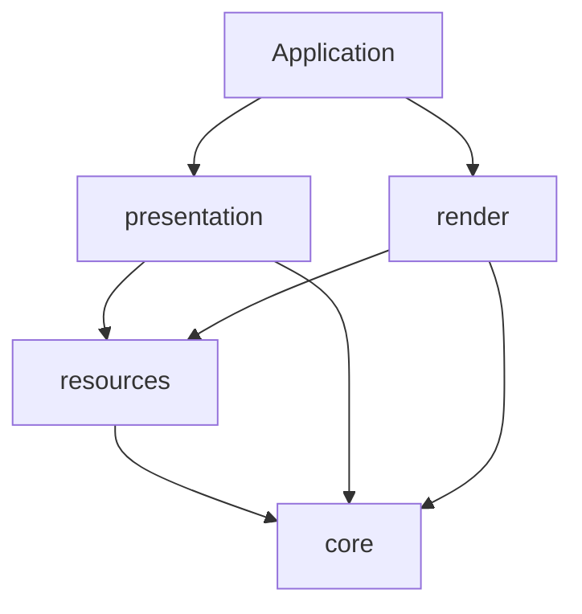

# Vulkan 代码分层

`include/lc1/vk/` 与 `src/vk/` 使用相同的四层目录。类型仍位于 `lc1` 命名空间，
Vulkan 调用继续使用 `vk::raii`；目录分层不改变资源所有权、提交顺序或销毁顺序。

| 目录 | 职责 | 代表类型与文件 |
|---|---|---|
| `core/` | Vulkan 绑定配置、loader、实例与设备创建、分配器 | `VulkanLoader`、`Instance`、`Device`、`memory.hpp` |
| `resources/` | GPU 存储、上传、命令录制、描述符、shader object 与图像屏障 | `CommandBuffer`、`one-time-submit.hpp`、`GpuBuffer`、`GpuImage`、`GpuTexture`、`GpuMesh`、`AccelerationStructure`、`DescriptorHeap` / `DescriptorHeapCache`、`ShaderObject`、`RenderTarget` |
| `presentation/` | 窗口表面、交换链策略、acquire/submit/present、帧槽同步 | `Surface`、`Swapchain`、`FrameLoop`、`swapchain-policy.hpp` |
| `render/` | 具体渲染算法、shader 接口、材质和绘制数据 | `Renderer`、`GraphicsShaders`、`GraphicsState`、`MaterialInfo`、`DrawItem`、`FrameResources`、阴影与色调映射 |

## 依赖方向

箭头表示“使用”。应用将呈现与渲染组合起来；两者没有彼此的实现依赖。

- `core` 不包含其他三层，也不包含窗口、场景或游戏类型。
- `resources` 可以使用 `core` 与 CPU 图像、顶点、切线数据，不依赖呈现、渲染或游戏。
- `presentation` 可以使用 `core`、`resources` 和 `Window`，不认识具体 `Renderer` 或材质。
- `render` 可以使用 `core`、`resources` 和场景输入，不读取窗口或交换链。

目前这四层仍编入 `lc1_engine`，CMake 源文件清单按层组织，没有新增四个独立链接目标。
公开头文件根目录仍共享，因此构建目标本身不强制隔离头文件；新增依赖时需遵守上述方向。

## 边界上的几个约定

`Device` 接收调用者选择的物理设备、队列族和 `DeviceRequirements`，负责创建设备与分配器。
应用在选择物理设备时查询表面的呈现支持；`Device` 本身不接收或保存表面。GPU 渲染测试
通过测试辅助函数完成设备筛选，再调用同一显式构造函数。

`CommandBuffer` 与 `one-time-submit.hpp` 位于 `resources/`，由呈现与渲染层共同使用。
`CommandBuffer` 拥有命令缓冲并维护当前录制的 heap 绑定缓存；绑定 heap 和 reset 统一经过它，
`DescriptorHeap` 的底层绑定入口仅供它调用。通过原生句柄改写 heap 绑定后，必须调用
`invalidate_bindings()`，再使用包装层的绑定与 push-data 接口。
`GraphicsShaders` 留在 `render/`，决定各 pass 绑定和清空哪些 shader 阶段，再调用
`CommandBuffer::bind_shaders`。资源层只接收 Vulkan 阶段与句柄，不依赖渲染层类型。

`FrameLoop<T>` 管理帧槽、命令缓冲和同步，通过回调调用渲染；模板参数由应用选择。
具体灯光、阴影、HDR 附件和描述符集合组成的 `FrameResources` 属于 `render`。
两者共享的 `RenderTarget` 只是非拥有的输出 image view 与 extent，放在 `resources`；
曝光和输出编码策略单独放在 `render/output-settings.hpp`。

`Pipeline`、`ShaderModule` 和 `ShaderStages` 已删除。通用 `ShaderObject` 在资源层读取
SPIR-V 并持有 `vk::raii::ShaderEXT`；渲染层的 `GraphicsShaders` 管理各 pass 的顶点/可选
片元阶段，`set_graphics_state` 记录固定功能的动态状态。shader 的 GPU 使用结束后才能销毁。
具体状态与逐采样约定见 [shader object](shader-objects.md)。
交换链 extent 选择位于 `presentation/swapchain-policy.*`，图像屏障位于
`resources/image-barrier.*`，`core/common.*` 只保留绑定配置与通用 Vulkan 诊断。

`GpuMesh` 负责上传、绘制和 BLAS 资源，不包含材质或每次绘制的变换。
这些引用与变换由 `render/draw-item.hpp` 的 `DrawItem` 表达。
CPU `Vertex` 位于 `lc1/vertex.hpp`，不包含 Vulkan；与 shader location、format 对应的
输入布局位于私有的 `src/vk/render/vertex-input.hpp`。

设备的固定扩展名与 feature 配置位于 `src/vk/core/device.cpp`；通用能力协商框架已移除。
绘制校验和顶点输入布局位于 `src/vk/render/`。应用只包含 `include/lc1/` 下的公开接口。
